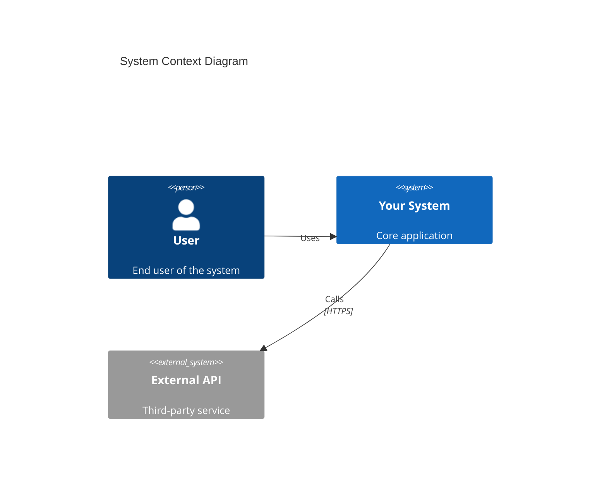
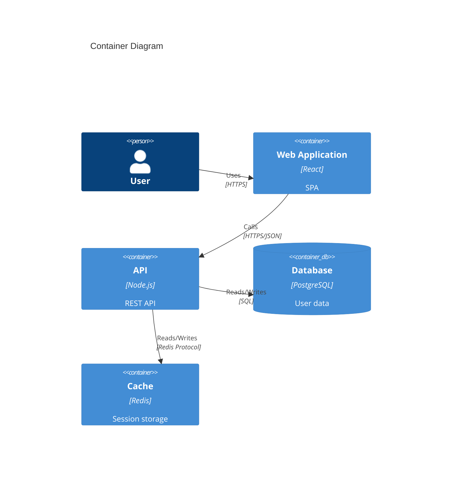
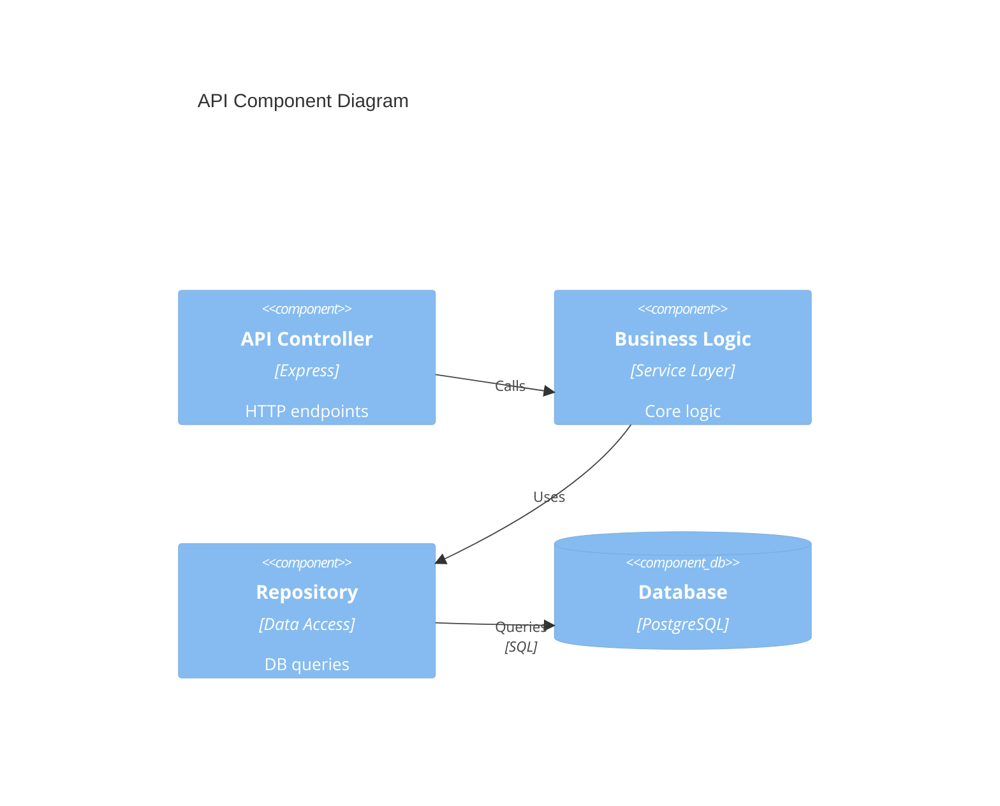
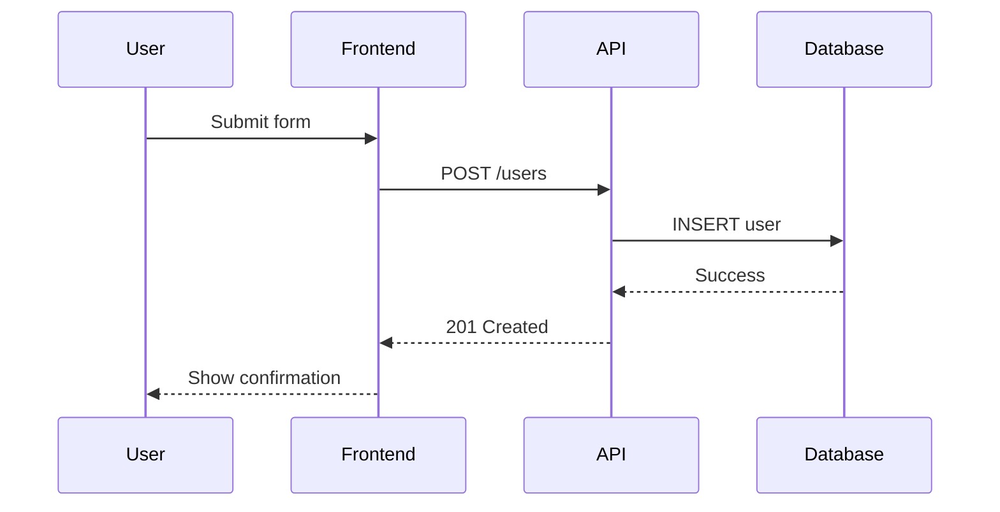
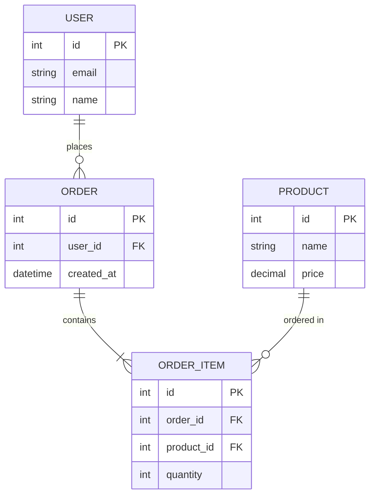
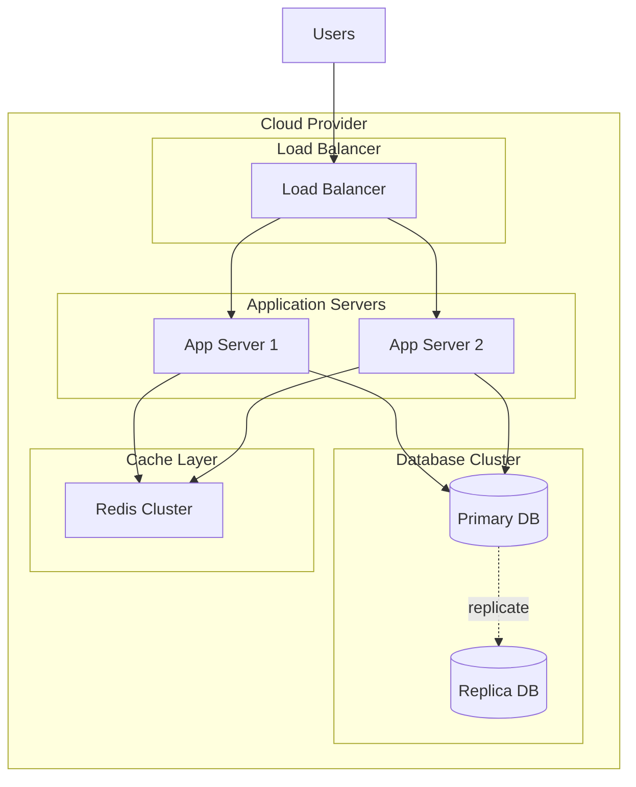
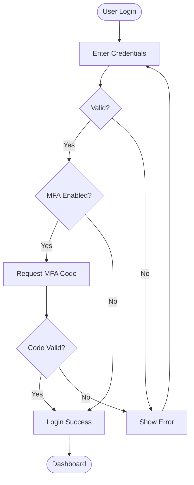
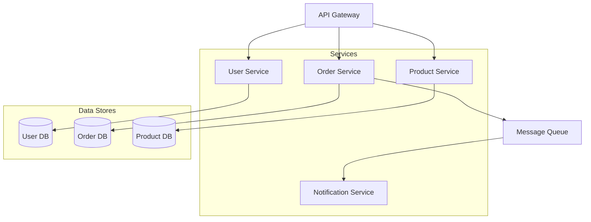
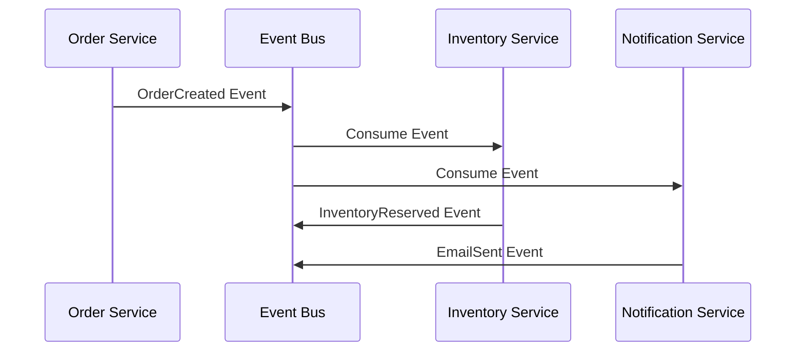
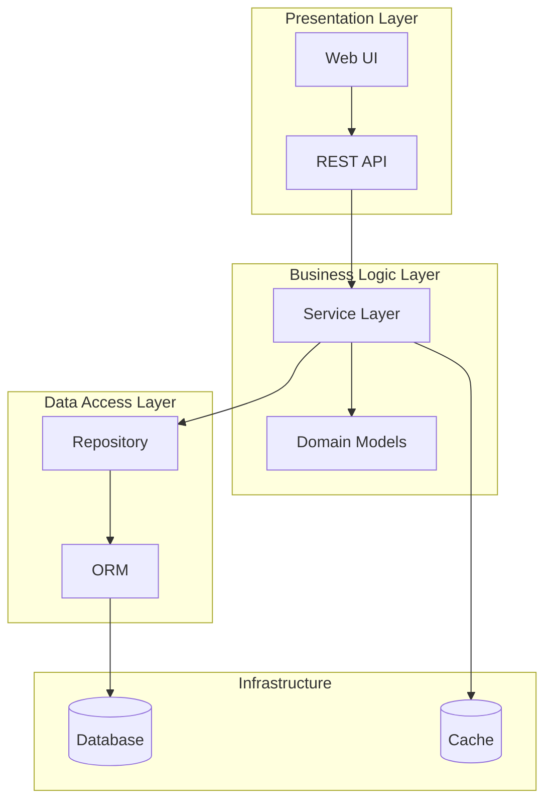

# Architecture Diagram Generator

Create comprehensive system architecture diagrams using Mermaid syntax and C4 model principles.

## Diagram Types

### 1. System Context (C4 Level 1)
Shows system and its external dependencies

### 2. Container Diagram (C4 Level 2)
Shows high-level technology choices

### 3. Component Diagram (C4 Level 3)
Shows internal components within a container

### 4. Sequence Diagram
Shows interaction flow over time

### 5. Entity Relationship Diagram
Shows database schema

### 6. Deployment Diagram
Shows infrastructure and deployment

### 7. Flowchart
Shows process or decision flow

## Generation Process

### 1. Understand Requirements

Ask clarifying questions:
- What system/component needs visualization?
- What level of detail is needed?
- Who is the audience? (Developers, architects, stakeholders)
- What specific aspects to highlight? (Data flow, deployment, interactions)

### 2. Select Appropriate Diagram Type

| Use Case | Diagram Type |
|----------|--------------|
| High-level system overview | System Context |
| Technology stack | Container Diagram |
| Internal architecture | Component Diagram |
| Request/response flow | Sequence Diagram |
| Database design | ER Diagram |
| Infrastructure | Deployment Diagram |
| Business process | Flowchart |

### 3. Create Diagram

Structure with:
- **Clear title**: Describes what the diagram shows
- **Consistent naming**: Use meaningful, consistent names
- **Proper grouping**: Use subgraphs for logical grouping
- **Relationship labels**: Annotate connections with protocols/data
- **Legend** (if needed): Explain symbols or colors

### 4. Provide Context

Accompany diagrams with:
- Written explanation of key components
- Design decisions and rationale
- Technology choices and why
- Known limitations or future improvements
- Links to related diagrams

## Best Practices

### Clarity
- Keep diagrams focused on one aspect
- Limit to 7-10 main components per diagram
- Use consistent direction (top-to-bottom or left-to-right)
- Avoid crossing lines when possible

### Completeness
- Include all critical components
- Show external dependencies
- Document data flow direction
- Specify protocols and data formats

### Hierarchy
- Start with high-level (Context)
- Drill down to detail (Container → Component)
- Create separate diagrams for complex subsystems
- Link related diagrams together

### Annotations
- Label relationships with protocols
- Add notes for important decisions
- Include version numbers
- Date diagrams for historical reference

## Architecture Patterns

### Microservices

### Event-Driven

### Layered Architecture

## Output Format

For each diagram request, provide:

1. **Mermaid Diagram Code**
   - Properly formatted and renderable
   - Includes title and clear labels

2. **Diagram Explanation**
   - What each component does
   - How components interact
   - Key design decisions

3. **Technology Details** (if applicable)
   - Specific technologies used
   - Communication protocols
   - Data formats

4. **Related Diagrams**
   - Links to complementary views
   - Drill-down diagrams for complex parts

## Examples

<example>
User: "Create an architecture diagram for an e-commerce system with React frontend, Node.js backend, PostgreSQL database, and Redis cache"

Output: Container-level C4 diagram showing:
- User interacting with React SPA
- React calling Node.js REST API
- API connecting to PostgreSQL and Redis
- External payment gateway integration
- Proper protocol labels (HTTPS, SQL, Redis protocol)
- Accompanied by explanation of each component
</example>

<example>
User: "Show me the login flow"

Output: Sequence diagram showing:
- User submitting credentials
- Frontend calling authentication API
- API validating against database
- JWT token generation
- Token returned to frontend
- Frontend storing in localStorage
- Subsequent requests with token
</example>

## Validation

Ensure diagrams:
- Render correctly in Mermaid
- Are not too complex (split if needed)
- Follow consistent styling
- Include all mentioned components
- Show accurate relationships
- Are appropriately detailed for audience

## Advanced Features

### Multiple View Support
Create comprehensive documentation with:
- System Context (external view)
- Container Diagram (technology stack)
- Component Diagram (internal structure)
- Sequence Diagrams (key flows)
- Deployment Diagram (infrastructure)

### Interactive Elements
- Clickable nodes linking to detailed docs
- Collapsible subgraphs for complexity management
- Color coding for component types
- Icons for technology identification
